# App for LearningWords

## Установка приложения
1. Находясь в [репозитории](https://github.com/mr-SkyDev/App-for-LearningWords), нажмите на последнюю версию проекта (как показано на скриншоте)  
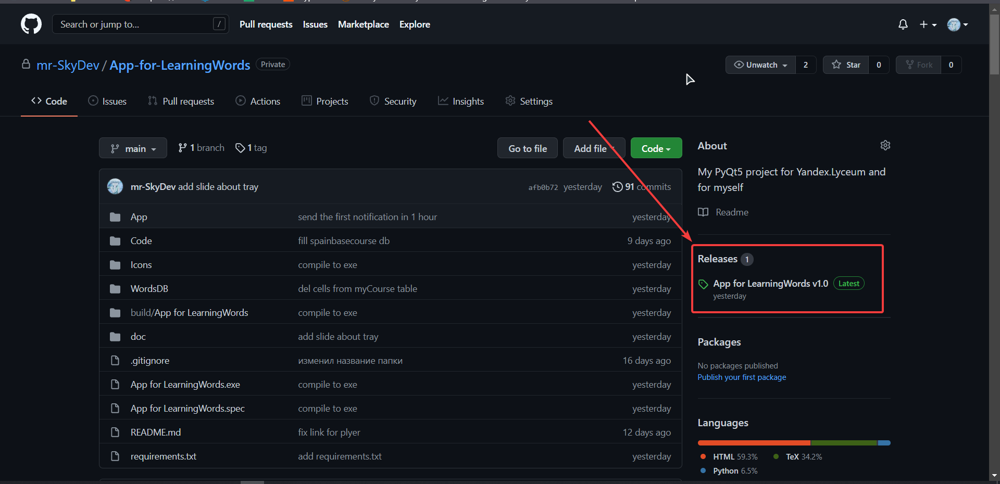
2. Перейдя во вкладку релизы, скачайте архив, нажав на выделенный объект  
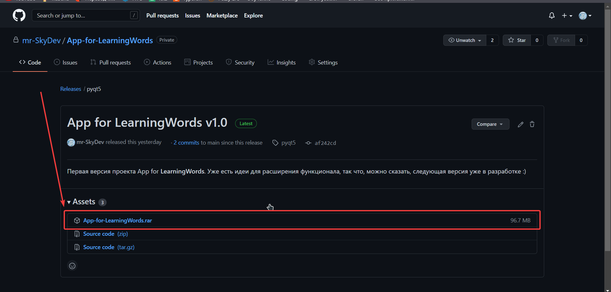
3. Распакуйте архив в папку **C:\Program Files**  
    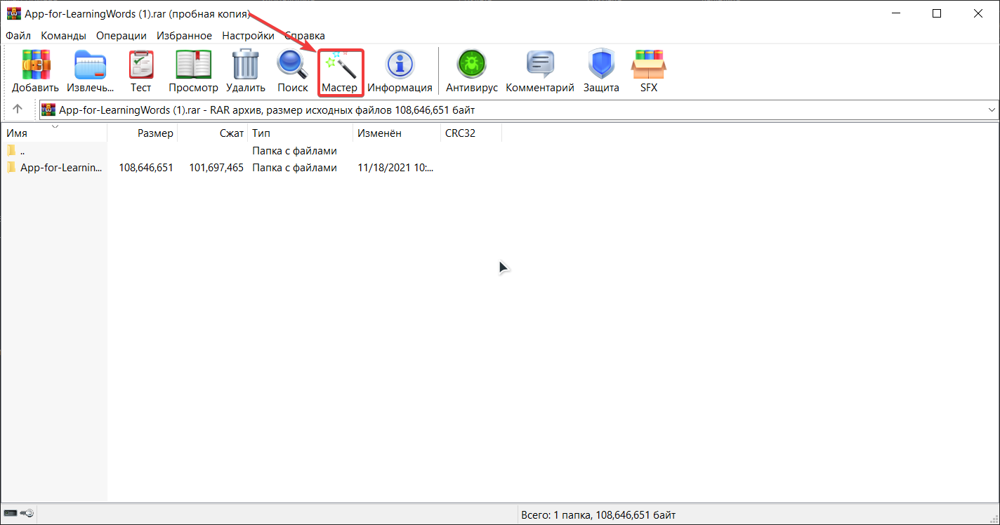  
    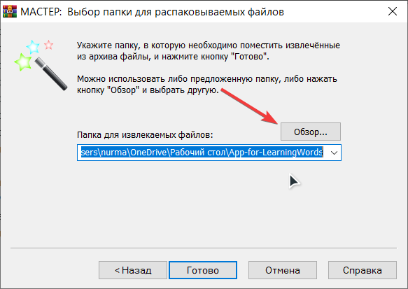  
    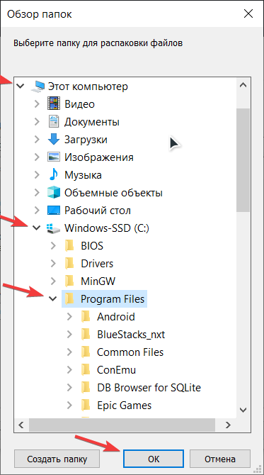  
    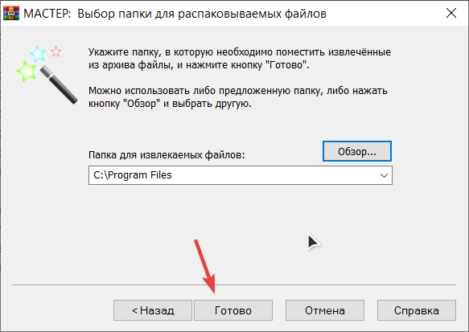  
4. Перейдите в проводнике в папку **C:\Program Files\App-for-LearningWords**, то есть куда вы установили приложение
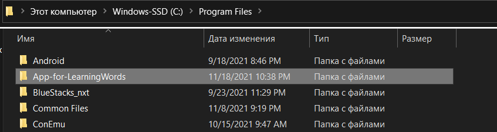 
5. Создайте ярлык приложения на рабочий стол (позже можно будет удалить)
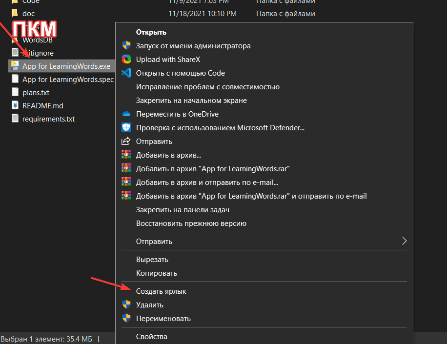
6. Откройте папку автозагрузки, нажав (win + R) и введя shell:startup  
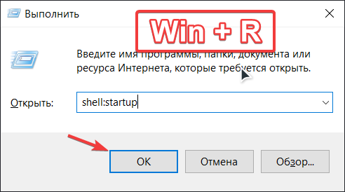
7. И после перетащите в эту папку ярлык с рабочего стола

Теперь приложение будет находится в автозагрузке и работать в фоновом режиме **корректно**

## Описание приложения
Десктопное приложение для изучения новых слов как **русских**, так и **иностранных**

На выбор имеется 4 курса:
  * русский *-медицинский*,
  * английский *-сленг*,
  * испанский *-база*,
  * собственный  
  **(список будет расширяться)**  

Их можно выбрать **несколько** штук на изучение.  
Как вы могли уже ранее заметить, у курсов есть сложность:
  * *база*,
  * *сленг*,
  * *мединский*  
  **(Список будет расширяться)**

Словам любого курса можно давать определение **вручную**. Иначе значение слова будет браться из интернета (используется определённый [источник](https://slovaronline.com)).  
4й курс отличается от других тем, что в него можно добавлять свои слова и их значения.  

Приложение для корректной работы должно быть в **автозагрузке** и работать в **фоновом режиме** (как это сделать описано в разделе «Установка приложения»).  

Слово и его значение отображается в уведомлении. В нем же расположены кнопки **«понял»** **«выучил»**. Первая закрывает уведомление, а вторая так же закрывает, но и удаляет это слово из **БД**. Если определение слишком большое, то будет предложено открыть новое окно с полным содержанием.  
Частоту отправки уведомлений можно настроить в окне настроек. 

---
## Какие технологии используются
* **PyQt5** — для создания тела приложения
* **SQLite** — для работы с БД приложения
* **BeautifulSoup4** — для составления БД
* **pyinstaller** — для конвертации в *.exe*

---
## Как использовать
### Главное окно  
На главном окне расположены 4 курса. Выбрать курс для изучения можно нажатием левой кнопки мыши. Тогда курс будет иметь оранжевый контур, который говорит о том, что он изучается вами.  
Также имеется кнопка, вызывающая настройки: она находится в правом нижнем углу. Подробнее о настройках можно будет узнать ниже  
Посмотреть, как выглядит главное окно можно увидеть на  данной гифке
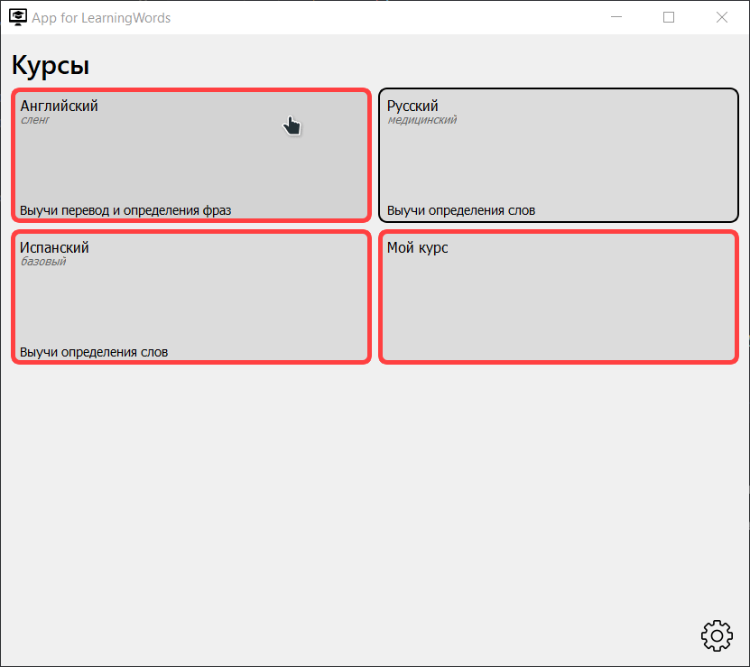

### Окно просмотра курса  
**Открывается при нажатии на ПКМ по курсу**  
Там вы можете редактировать данные курса, а именно:
* Само слово
* Его значение
* И изучаете ли вы его (колонка «Используется»), куда нужно вставлять данные +/-  

Если вы изменили значение какой-либо ячейки, то будет предложено сохранить данные. Обратите внимание, что если вы ввели некорректные данные, то в левом нижем углу будет написано соответствующее сообщение.  
В встроенных курсах вы можете только редактировать данные, а в пользовательском «Мой курс» вы способны к прочему добавлять ряды нажатием на соответствующую кнопку. После ввода новых данных будет предложено так же их сохранить.  
Работу данного окна я продемонстрировал в гифе ниже

### Окно настроек  
Окно настроек вызывается нажатием на соответствущую кнопку, расположенной на главном окне.  
Там **пока что** можно лишь настроить частоту отправки уведомлений *(от часа до раз в сутки)*. В будущих версиях планируется добавить настройки шрифта для тех, у кого плохое зрение; также настройки темы приложения.   
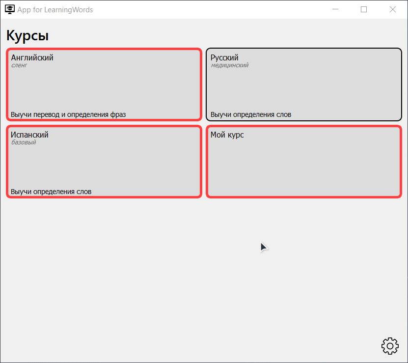

### Уведомления
Уведомления вылезают из правого нижнего угла. В независимости от того, какое разрешение у вашего эрана, оно всегда будет там.  
Частоту отправки можно настроить в настройках, которые описаны выше.  
В уведомлении находится следующая информация:
* Название окна — из какого курса взято слово
* Само слово
* И его значение

Там же имеется 2 кнопки: «Понял(а)» и «Выучил(а)»  
Первая просто закрывает окно уведомлений *(то же самое, что и закрыть его через крестик в правом верхнем углу)*  
Вторая убирает данного слово из изучаемых, то есть в колонке «Используется» отмечается "-". И пока вы снова не выберете слово для изучения, оно не будет появляться в уведомлениях.

Если содержимое сообщения слишком большое, то будет показана не вся часть, а лишь первые 300 символов, остальное можно будет увидеть при нажатии на кнопку «Показать полностью»  

### Управление приложением с помощью области уведомлений (трей)
Как упоминалось ранее, приложение работает в фоновом режиме.  
Увидеть, что приложение работает, можно в трее *(см. скриншот)*  
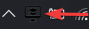  
Если вы его там не видите, то посмотрите в стрелочке, показывающей вверх (^). Если и там его нет, то значит приложение не было запущено. Открыв приложение через ярлык или напрямую через папку приложения, оно должно находится в одном из двух мест, которые я описал выше  
Теперь, когда вы видите иконку, нажмите на нее правой кнопкой мыши. У вас откроется список команд:
* **Show** — открыть окно
* **Hide** — скрыть окно в трей
* **Exit** — завершить работу приложения *(уведомления тоже перестанут присылаться)*
* **Random notify** — показать случайное слово и его значение из выбранных курсов

Тем самым можно управлять приложением из области уведомлений  
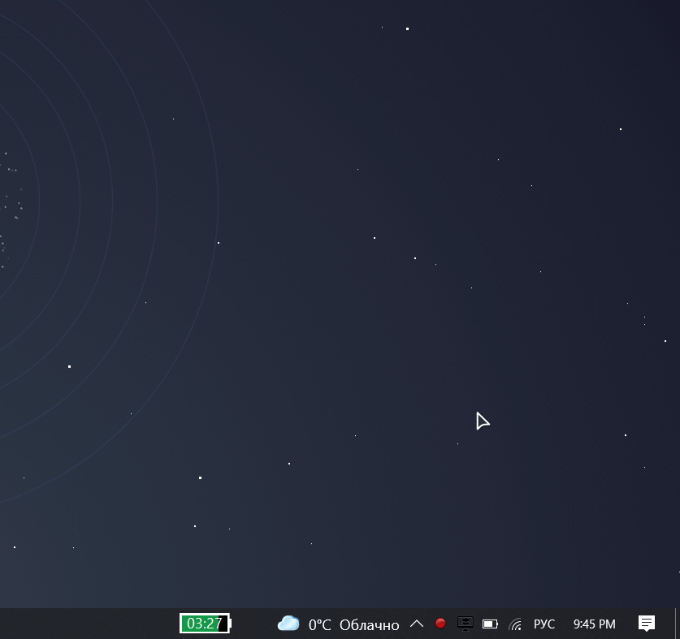